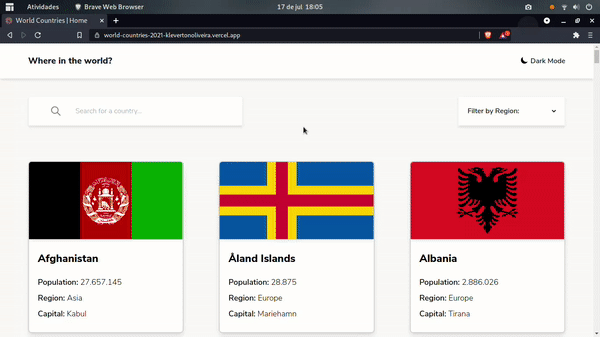

# World Countries App (English / Português)
[](https://github.com/KlevertonOliveira/World-Countries-APP-NextJS/blob/main/LICENSE)

---

## :art: Layout web



---

[Project Presentation](https://world-countries-2021-klevertonoliveira.vercel.app/) /
[Apresentação do Projeto](https://world-countries-2021-klevertonoliveira.vercel.app/)

---

## :mag_right: About the project / Sobre o projeto

World Countries App is an application developed as a solution to the [challenge](https://www.frontendmentor.io/challenges/rest-countries-api-with-color-theme-switcher-5cacc469fec04111f7b848ca) named "REST Countries API with color theme switcher" proposed by the website [Frontend Mentor](https://www.frontendmentor.io/). As a differential for the development of this application, I chose to use NextJS and TailwindCSS Frameworks in order to make the development faster and more responsive.

The application implements a grid containing a list of 250 countries and their respective information, which are obtained through an API, enabling the implementation of the Static Site Generator concept (worked on NextJS in the case of this application). In addition, the application also has a filtering component, which uses the criteria of regions/continents, and a search field, which are responsible for returning to the user a list of countries that meet the conditions informed.
Clicking on any of the available countries directs the user to a specific page for the selected country, which contains several more detailed information about that country. Finally, the project also implements the idea of theme switcher on all application pages.
As it is fully responsive, the application is suitable for viewing by devices with different screen sizes.

---

World Countries App é uma aplicação desenvolvida como solução ao [desafio](https://www.frontendmentor.io/challenges/rest-countries-api-with-color-theme-switcher-5cacc469fec04111f7b848ca) denominado "REST Countries API with color theme switcher" proposto pelo site [Frontend Mentor](https://www.frontendmentor.io/). Como diferencial para o desenvolvimento deste aplicativo, optei por utilizar os Frameworks NextJS e TailwindCSS com o intuito de tornar o desenvolvimento mais rápido e responsivo.

A aplicação implementa um grid contendo uma lista com 250 países e suas respectivas informações, as quais são obtidas através de uma API, possibilitando a implementação do conceito de Static Site Generator (trabalhado no NextJS no caso desta aplicação). Além disso, a aplicação também dispõe de um componente de filtragem, que utiliza o critério de regiões/continentes, e um campo de busca, os quais são responsáveis por retornar ao usuário uma lista dos países que atendem às condições informadas. 
Clicando em qualquer um dos países disponíveis direciona o usuário a uma página específica para o país selecionado, a qual contém diversas informações mais detalhadas acerca deste país. Por fim, o projeto implementa, também, a ideia de troca de temas em todas as páginas da aplicação. 
Por ser totalmente responsiva, a aplicação atende a visualização por aparelhos com tamanhos de tela variados.

---

## :gear: Technologies Used / Tecnologias utilizadas

### Front end
- HTML5
- [Tailwind CSS](https://tailwindcss.com/) (CSS Framework)
- Javascript ES6
- [NextJS](https://nextjs.org/) (React Framework)

## :file_folder: How to run the project / Como executar o projeto

Prerequisites / Pré-requisitos: npm / yarn

```bash
# Clone repository / Clonar repositório
git clone https://github.com/KlevertonOliveira/World-Countries-APP-NextJS.git

# Enter the project folder / Entrar na pasta do projeto
cd World-Countries-APP-NextJS

# Install dependencies / Instalar dependências
yarn install

# Run the project / Executar o projeto
yarn dev or/ou yarn build && yarn start
```

## :raising_hand_man: Author / Autor

José Kleverton Yvens Oliveira

https://www.linkedin.com/in/kleverton-oliveira/

